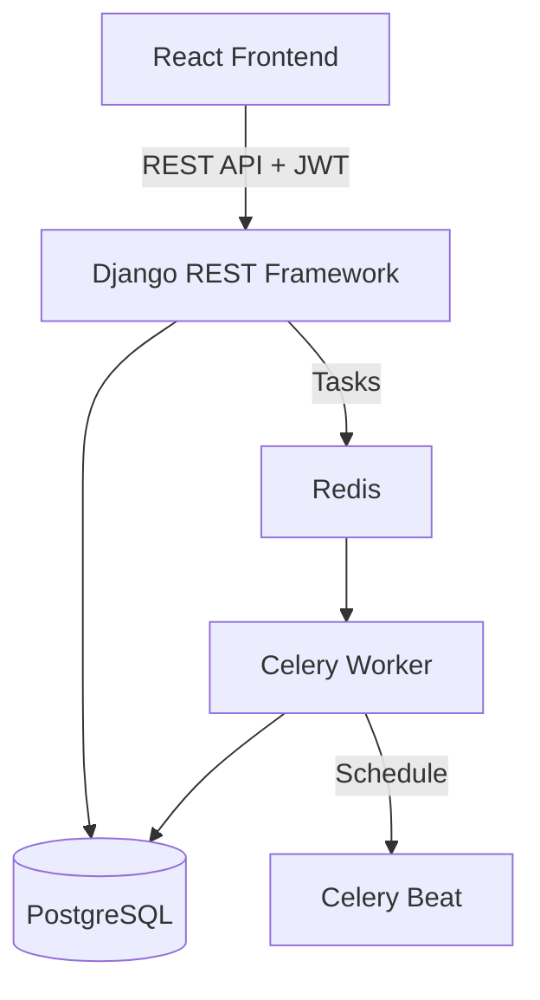
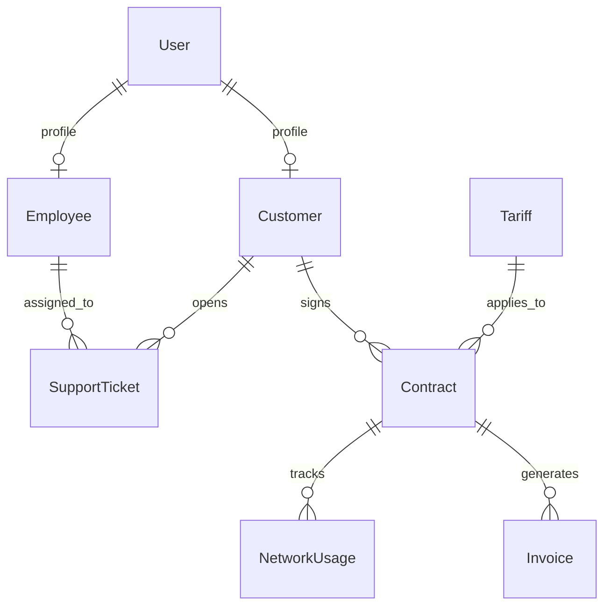

# ISP Management System

## Overview
The ISP Management System is a comprehensive enterprise resource planning (ERP) solution tailored for Internet Service Providers. It streamlines core business operations including customer onboarding, automated technical support ticket assignment, dynamic billing, and advanced manager analytics. The system leverages automated scoring and recommendation engines to optimize service delivery and customer retention.

## Core Feature Implementation

### 🛠 Technician Auto-Assignment
- **Mechanism**: Django Signals (`post_save`) on the `SupportTicket` model.
- **Logic**: When a "technical" ticket is created, the system queries for available `Employee` records with the 'Technician' role.
- **Optimization**: It selects the technician with the lowest number of active (New/Open/In-Progress) tickets to ensure balanced workload distribution.

### 📊 Manager Analytics Dashboard
- **Aggregation**: Complex SQL aggregations using Django's `Sum`, `Count`, and `Avg` functions across multiple models (Invoices, Customers, Tickets, Usage).
- **Visualization**: Frontend integration with Recharts to display:
  - Revenue trends (6-month history)
  - Ticket resolution efficiency
  - Tariff popularity and service distribution
  - Network usage heatmaps and trends.

### 🎯 Client Scoring Engine
- **Algorithm**: A daily Celery task evaluates every customer against a 100-point scale:
  - **Contract Fidelity (30 pts)**: Points based on the longevity of the customer relationship.
  - **Payment Reliability (30 pts)**: Penalties for overdue invoices in the last 12 months.
  - **Support Burden (20 pts)**: Reward for low support ticket volume in the last 30 days.
- **Usage**: Helps managers identify "at-risk" customers or candidates for loyalty rewards.

### 💡 Tariff Recommendation Engine
- **Analysis**: Evaluates the last 3 months of `NetworkUsage` (daily download/upload totals).
- **Triggers**:
  - **Downgrade**: If usage is <40% of the current limit, suggests a more economical plan.
  - **Upgrade**: If usage is >90% of the limit, suggests a higher-tier plan to prevent service degradation.
- **Automation**: Recommendations are generated daily and stored for manager approval.

### ⏳ Dynamic SLA Tracking
- **Monitoring**: Every hour, a Celery task scans all active technical tickets.
- **Detection**: Compares `sla_deadline` with the current server time.
- **Notification**: Tickets exceeding deadlines are marked as `is_sla_breached`, triggering visual priority in the dashboard and potential automated escalations.

### 💳 Billing & Invoicing
- **Automation**: Monthly invoice generation based on active contract terms and tariff pricing.
- **Negative Balance Protection**: If a customer's balance remains negative for >3 days, the system automatically suspends active contracts and notifies the user.
- **PDF Exports**: On-the-fly generation of professional PDF receipts and contracts using `ReportLab`.

## Tech Stack
| Component | Technology | Version |
|-----------|------------|---------|
| Backend   | Django / DRF | 5.2 |
| Frontend  | React      | 19 |
| Database  | PostgreSQL | 16 |
| Cache/Broker | Redis   | 7 |
| Workers   | Celery     | 5.4 |
| Styling   | Material UI| 7 |
| Auth      | JWT        | SimpleJWT |

## Features
- **Technician Auto-Assignment**: Automatically routes technical tickets to the least loaded available technician.
- **Manager Analytics Dashboard**: High-level business intelligence visualization using Recharts.
- **Client Scoring Engine**: Automated health scoring based on payment history and support interactions.
- **Tariff Recommendation Engine**: Smart service upgrade suggestions based on actual network usage.
- **Dynamic SLA Tracking**: Real-time monitoring of support ticket deadlines with breach alerts.
- **Billing & Invoicing**: Automated invoice generation, payment tracking, and PDF receipt exports.

## Architecture


## Quick Start

### Prerequisites
- Python 3.11+
- Node.js 18+
- PostgreSQL 14+
- Redis 7+

### Backend Setup
```bash
cd backend
python -m venv venv
source venv/bin/activate  # Windows: venv\Scripts\activate
pip install -r requirements.txt
cp .env.example .env      # fill in your values
python manage.py migrate
python manage.py createsuperuser
python manage.py runserver
```

### Frontend Setup
```bash
cd frontend
npm install
npm run dev
```

### Celery Workers
```bash
# In separate terminals:
celery -A backend worker -l info
celery -A backend beat -l info
```

## Docker Quick Start

### Run everything with one command:
```bash
cp backend/.env.example backend/.env
# Fill in your values in backend/.env
docker-compose up --build
```

### Services will be available at:
- Frontend: http://localhost:5173
- Backend API: http://localhost:8000
- Database: localhost:5432
- Redis: localhost:6379

### Useful commands:
```bash
# Run in background
docker-compose up -d

# View logs
docker-compose logs -f backend
docker-compose logs -f celery_worker

# Run migrations manually
docker-compose exec backend python manage.py migrate

# Create superuser
docker-compose exec backend python manage.py createsuperuser

# Stop everything
docker-compose down

# Stop and remove volumes (clears database)
docker-compose down -v
```

## Environment Variables
| Variable | Description | Example |
|----------|-------------|---------|
| SECRET_KEY | Django security key | (generated) |
| DEBUG | Toggle debug mode | True/False |
| DB_HOST | Database host | db / localhost |
| REDIS_URL | Redis connection string | redis://redis:6379/0 |
| CORS_ALLOWED_ORIGINS | Allowed domains | http://localhost:5173 |

## Automated Tasks
| Task | Schedule | Description |
|------|----------|-------------|
| check_sla_breaches | Hourly | Monitors support tickets for SLA deadline violations. |
| check_negative_balances | Daily | Identifies customers with negative balances. |
| check_low_balances | Daily | Proactively notifies customers with low funds. |
| calculate_all_scores | Daily | Updates customer health scores based on activity. |
| generate_all_recommendations | Daily | Analyzes usage to suggest better tariff plans. |

## API Overview
| Method | Endpoint | Auth Required | Description |
|--------|----------|---------------|-------------|
| POST | /api/auth/token/ | No | Obtain JWT token pair (Login). |
| POST | /api/auth/register/ | No | Register new customer. |
| GET | /api/auth/user/ | Yes | Get current user profile. |
| GET | /api/customers/ | Yes (Manager) | List all customers (filterable).|
| GET | /api/customers/dashboard/ | Yes (Owner) | Get personal dashboard data. |
| GET | /api/contracts/ | Yes | List active contracts. |
| GET | /api/invoices/ | Yes | List billing invoices. |
| GET | /api/support-tickets/ | Yes | List/Create support issues. |
| GET | /api/dashboard/manager/ | Yes (Manager) | Consolidated business analytics.|
| GET | /api/recommendations/ | Yes (Manager) | Smart tariff upgrade list. |
| POST | /api/payments/ | Yes (Owner) | Register new payment. |
| GET | /api/equipment/ | Yes (Manager) | Monitor hardware stock. |
| GET | /api/network-usage/ | Yes | Personal usage statistics. |
| PATCH | /api/notifications/ | Yes | Mark notifications as read. |
| GET | /api/contracts/{id}/pdf/ | Yes | Download contract as PDF. |

## Database Schema


## Security
- **JWT Authentication**: Secure stateless authentication for all API requests.
- **Rate Limiting**: Protection against brute-force attacks on login (5/m) and registration (3/10m).
- **Role-Based Access (RBAC)**: Strict separation of Customer, Support, Manager, and Admin capabilities.
- **Security Headers**: XSS protection, Content-Type sniffing prevention, and DENY X-Frame-Options.
- **Sensitive Data Protection**: Internal fields like balance tracking are read-only and secured.

## Project Structure
```text
.
├── backend/                # Django Application
│   ├── api/                # Core Logic
│   │   ├── services/       # Business Logic Services
│   │   ├── tasks/          # Celery Async Tasks
│   │   ├── views/          # API Endpoints
│   │   ├── models.py       # DB Schema
│   │   └── serializers.py  # Data Marshalling
│   └── backend/            # Project Configuration
├── frontend/               # React Application
│   ├── src/
│   │   ├── components/     # UI Components
│   │   ├── hooks/          # Custom React Hooks
│   │   ├── pages/          # Page Components
│   │   └── services/       # API Integration
├── docker-compose.yml      # Orchestration
└── README.md               # Documentation
```
