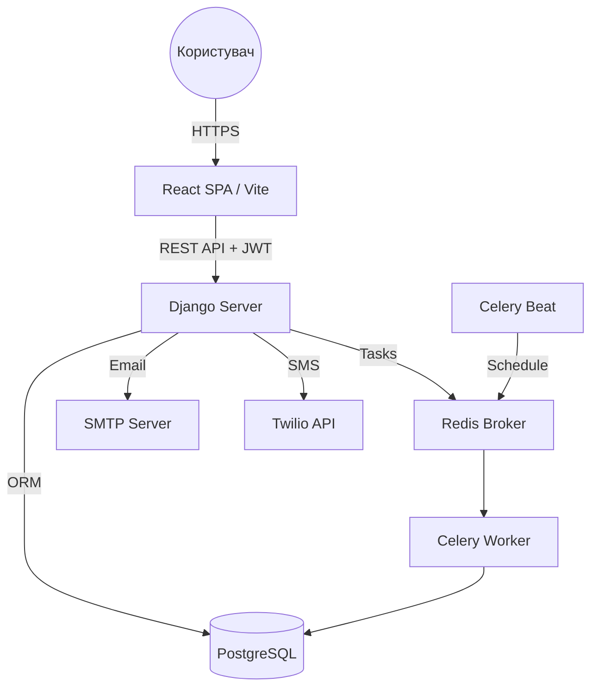
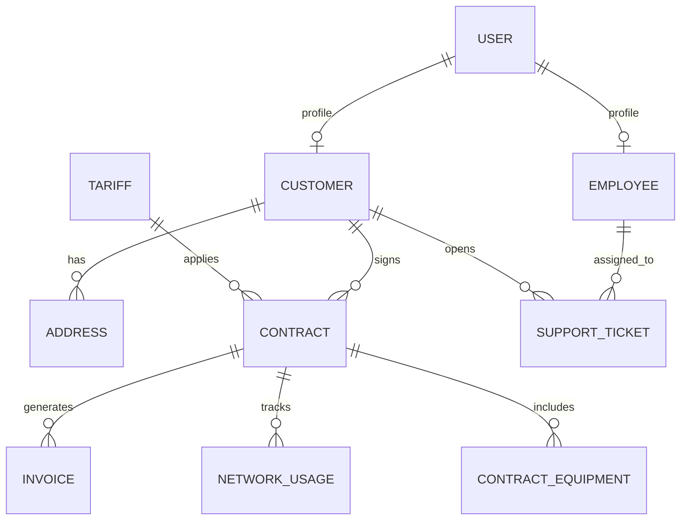

# 🌐 ISP Management System (Billing & CRM)

Система управління інтернет-провайдером — це комплексне full-stack рішення для автоматизації бізнес-процесів ISP, що охоплює білінг, технічну підтримку, управління інфраструктурою та інтелектуальний аналіз поведінки клієнтів.

## 1. Огляд системи
Система забезпечує повний життєвий цикл взаємодії з абонентом:
- **Основна мета:** Автоматизація операційної діяльності провайдера від моменту реєстрації нового клієнта до щомісячного виставлення рахунків та моніторингу якості послуг.
- **Сценарії користувача:**
    1. **Клієнт:** Реєстрація → Вибір тарифу → Заявка на підключення → Моніторинг використання → Оплата рахунків → Створення тікетів підтримки.
    2. **Менеджер:** Аналітика доходів → Управління тарифами → Розгляд рекомендацій щодо апгрейду клієнтів → Контроль дебіторської заборгованості.
    3. **Технік/Підтримка:** Виконання заявок на підключення → Вирішення інцидентів (SLA) → Облік обладнання.
- **Межі системи:**
    - **Внутрішні:** Auth, Billing Engine, CRM, Inventory, Analytics.
    - **Зовнішні:** Twilio (SMS), SMTP (Email).

## 1.1 Функціональні модулі та алгоритми

### 🛠 Автоматичний розподіл техніків
- **Механізм:** Використання Django Signals (`post_save`) для моделі `SupportTicket`.
- **Логіка:** При створенні тікету типу "technical", система шукає доступних співробітників з роллю "Technician".
- **Оптимізація:** Тікет призначається техніку з найменшою кількістю активних задач (New/Open/In-Progress) для рівномірного навантаження.

### 📊 Панель аналітики менеджера
- **Агрегація:** Використання SQL-агрегацій (`Sum`, `Count`, `Avg`) через Django ORM.
- **Метрики:**
  - Динаміка доходів за останні 6 місяців.
  - Ефективність вирішення тікетів (середній час закриття).
  - Популярність тарифних планів.
  - Теплова карта мережевого навантаження.

### 🎯 Двигун скорингу клієнтів (Client Scoring)
- **Алгоритм:** Щоденна задача Celery оцінює клієнта за 100-бальною шкалою:
  - **Лояльність (30 балів):** Нараховуються залежно від тривалості контракту (більше року = max).
  - **Фінансова дисципліна (30 балів):** Штрафні бали за прострочені інвойси за останні 12 місяців.
  - **Навантаження на підтримку (20 балів):** Бонус за відсутність частих звернень за останні 30 днів.
- **Мета:** Виявлення клієнтів у зоні ризику відтоку або кандидатів на преміальні програми.

### 💡 Система рекомендацій тарифів
- **Аналіз:** Оцінка `NetworkUsage` за останні 3 місяці (середньодобовий обсяг трафіку).
- **Тригери:**
  - **Downgrade:** Якщо споживання <40% ліміту, система пропонує дешевший тариф.
  - **Upgrade:** Якщо споживання >90% ліміту, пропонується тариф з вищим лімітом для уникнення деградації сервісу.
- **Процес:** Рекомендації генеруються автоматично та очікують на розгляд менеджером.

### ⏳ Динамічний моніторинг SLA
- **Контроль:** Погодинна перевірка всіх активних технічних тікетів.
- **Виявлення:** Порівняння `sla_deadline` з поточним часом.
- **Дія:** Тікети з простроченим дедлайном отримують статус `is_sla_breached`, що підсвічує їх у дашборді та ініціює сповіщення.

### 💳 Автоматизація білінгу
- **Генерація:** Щомісячне створення інвойсів на основі активних контрактів.
- **Захист від заборгованості:** Якщо баланс залишається негативним >3 днів, система автоматично призупиняє дію контракту.
- **Експорт:** Генерація PDF-контрактів та квитанцій "на льоту" за допомогою бібліотеки `ReportLab`.

## 2. Технологічний стек

| Шар | Технологія | Версія | Категорія | Призначення |
| :--- | :--- | :--- | :--- | :--- |
| **Frontend** | React | 19.0 | Framework | Побудова SPA інтерфейсу |
| **Styling** | Material UI (MUI) | 7.0 | UI Library | Дизайн-система та компоненти |
| **Backend** | Django | 4.2 | Framework | Основна бізнес-логіка та ORM |
| **API** | Django REST Framework | 3.16 | Toolkit | Побудова RESTful API |
| **База даних** | PostgreSQL | 16 | RDBMS | Надійне збереження даних |
| **Кеш / Черга** | Redis | 7.0 | Broker | Брокер повідомлень для Celery |
| **Фонові задачі**| Celery / Celery Beat| 5.6 / 2.9 | Worker/Scheduler| Асинхронні розрахунки та періодичні задачі |
| **Авторизація** | JWT (SimpleJWT) | 5.5 | Security | Автентифікація через токени |
| **Документація** | drf-yasg (Swagger) | 1.21 | API Docs | Автогенерація документації API |
| **DevOps** | Docker / Compose | - | Infrastructure | Контейнеризація сервісів |

## 3. Архітектура системи

### Загальна схема зв'язків


### Взаємодія компонентів та черги задач
Система використовує подієво-орієнтований підхід для важких операцій:

1.  **Django ↔ Redis ↔ Celery:** 
    - Django виступає як продюсер задач. Коли потрібно виконати фонову дію (наприклад, перерахувати скоринг), задача поміщається в чергу **Redis**.
    - **Celery Worker** постійно моніторить чергу та виконує задачі асинхронно, не блокуючи основний потік HTTP-запитів.
    - **Celery Beat** виконує роль планувальника (cron), запускаючи регулярні перевірки SLA та генерацію інвойсів за розкладом.
    
2.  **Frontend ↔ Backend:**
    - Комунікація відбувається виключно через REST API. 
    - Для безпеки кожен запит супроводжується заголовком `Authorization: Bearer <JWT>`, який валідується на стороні Django за допомогою `SimpleJWT`.
    
3.  **Database Strategy:**
    - **PostgreSQL** забезпечує цілісність даних через транзакції, що критично для білінгових операцій.
    - Всі фінансові зміни супроводжуються записом у таблицю `BalanceTransaction` для аудиту.

### Шляхи комунікації
- **Синхронні:** HTTP-запити від фронтенду до бекенду (Django) для отримання/зміни даних.
- **Асинхронні:** Обробка важких задач (генерація PDF, розрахунок скорингу, перевірка SLA) через Celery.
- **Шлюз:** Роль Gateway у локальній розробці виконує Docker Compose (порти 8000 та 5173).

## 4. Структура репозиторію
Проєкт організований як **Монорепозиторій**:

```text
.
├── backend/                # Django проект
│   ├── api/                # Основний додаток (Models, Views, Serializers)
│   │   ├── services/       # Бізнес-логіка (Scoring, Billing, Recommendations)
│   │   ├── tasks/          # Асинхронні задачі Celery
│   │   └── management/     # Кастомні команди (populate_db)
│   └── backend/            # Конфігурація проекту (settings.py, celery.py)
├── frontend/               # React проект
│   ├── src/
│   │   ├── components/     # UI компоненти
│   │   ├── context/        # Управління станом (Auth, Toast)
│   │   └── services/       # Клієнти для API викликів
├── docker-compose.yml      # Оркестрація контейнерів
└── README.md               # Ця документація
```

## 5. Аналіз Backend

### API Ендпоінти
| Метод | Шлях | Авторизація | Призначення |
| :--- | :--- | :--- | :--- |
| `POST` | `/api/auth/token/` | Ні | Логін (отримання JWT) |
| `POST` | `/api/auth/register/` | Ні | Реєстрація клієнта |
| `GET` | `/api/customers/` | Менеджер | Список абонентів |
| `GET` | `/api/contracts/` | Так | Контракти поточного юзера |
| `POST` | `/api/support-tickets/` | Так | Створення запиту в підтримку |
| `GET` | `/api/dashboard/manager/`| Менеджер | Зведена бізнес-аналітика |
| `GET` | `/api/recommendations/` | Менеджер | Пропозиції щодо зміни тарифів |

### Схема бази даних


## 6. Аналіз Frontend
- **Routing:** Використовується `react-router-dom` v7.
- **State Management:** React Context API для автентифікації (`AuthContext`) та повідомлень (`ToastContext`).
- **Компоненти:** Модульна архітектура, де кожна сутність (Employee, Customer) має власні таби та графіки.
- **API Connection:** Власний сервіс на базі `axios` з автоматичним додаванням `Authorization: Bearer <token>`.

## 7. Потік даних — від початку до кінця
Приклад: Оплата рахунку
1. **UI:** Користувач натискає "Pay Now" в кабінеті.
2. **Frontend:** Виклик `api.post('/payments/', data)`, стан стає `loading`.
3. **Backend:** Перевірка JWT, валідація суми в `PaymentSerializer`.
4. **Business Logic:** Виклик `record_transaction`, оновлення балансу `Customer`, створення `BalanceTransaction`.
5. **Database:** ACID транзакція оновлює баланс та створює запис оплати.
6. **Response:** Бекенд повертає статус 201.
7. **UI Update:** Фронтенд оновлює баланс на екрані та показує Success Toast.

## 8. Автентифікація та авторизація
- **Стратегія:** Stateless JWT. Токени зберігаються в `localStorage`.
- **Ролі:** 
    - `Admin`: Повний доступ.
    - `Manager`: Аналітика, тарифи, управління контрактами.
    - `Support`: Робота з тікетами.
    - `Technician`: Виконання заявок на підключення.
    - `Customer`: Перегляд власних послуг, оплата, підтримка.

## 9. База даних та сховище
- **PostgreSQL:** Основне сховище. Міграції через `manage.py migrate`.
- **Redis:** Кешування результатів аналітики та черга задач.
- **Files:** Контракти та інвойси генеруються як PDF (ReportLab).

## 10. Зовнішні інтеграції
- **Twilio:** Використовується для SMS-сповіщень про критичний баланс.
- **SMTP:** Надсилання інвойсів та підтвердження реєстрації.
- **⚠️ Відкриті питання:** Наразі інтеграція Twilio в коді присутня як сервіс, але потребує налаштування API ключів в `.env`.

## 11. Конфігурація
| Змінна | Шар | Обов'язкова | Призначення |
| :--- | :--- | :--- | :--- |
| `SECRET_KEY` | Backend | Так | Ключ безпеки Django |
| `DB_PASSWORD` | Infrastructure | Так | Пароль до PostgreSQL |
| `REDIS_URL` | Backend/Workers | Так | URL брокера повідомлень |
| `CORS_ALLOWED_ORIGINS`| Backend | Так | Дозвіл для фронтенду |

## 12. Стратегія тестування
- **Backend:** Тести в `api/tests.py` (APITestCase).
- **Покриття:** Логіка транзакцій, генерація інвойсів, SLA трекінг, розрахунок скорингу.
- **Запуск:** `docker-compose exec backend python manage.py test`.

## 13. CI/CD та розгортання
- **Infrastructure as Code:** Docker Compose визначає всі залежності.
- **Production:** Рекомендується використання Nginx як Reverse Proxy.

## 14. Локальне налаштування
1. **Клонування:** `git clone <repo_url> && cd isp`
2. **Конфігурація:** `cp backend/.env.example backend/.env`
3. **Запуск:** `docker-compose up --build`
4. **Ініціалізація:**
    - Міграції: `docker-compose exec backend python manage.py migrate`
    - Дані: `docker-compose exec backend python manage.py populate_db`
    - Адмін: `docker-compose exec backend python manage.py createsuperuser`
5. **Порти:**
    - Frontend: `http://localhost:5173`
    - API: `http://localhost:8000`
    - Swagger: `http://localhost:8000/swagger/`
